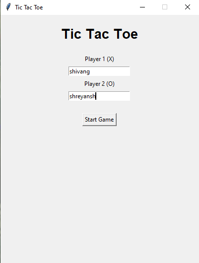
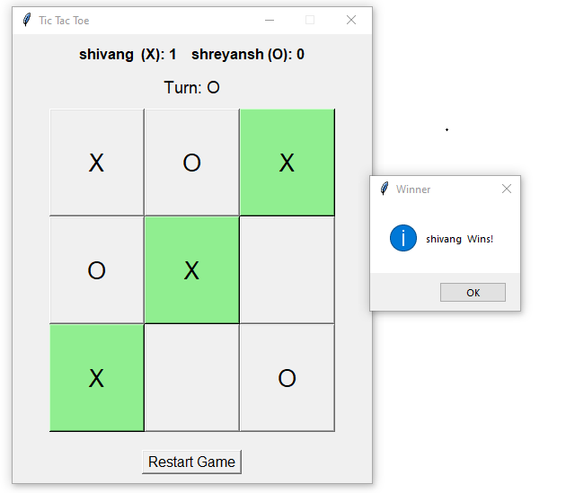
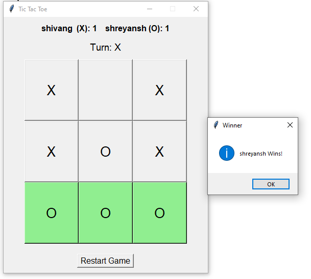
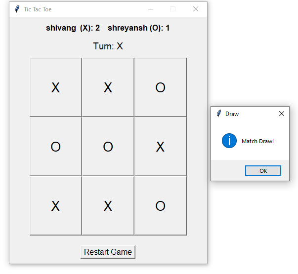

#  Tic Tac Toe Game

A GUI-based Tic Tac Toe game developed using Python and Tkinter.

## Features

* Two-player gameplay
* Player name input
* Turn management
* Winner detection
* Draw detection
* Score tracking
* Winning combination highlighting
* Restart game functionality

## Technologies Used

* Python
* Tkinter

  

## Screenshots

### Start Screen


### X Wins


### O Wins


### Draw Match


## How to Run

```bash
python tic_tac_toe.py
```

## Learning Outcomes

* GUI Development using Tkinter
* Event-Driven Programming
* Winner Detection Logic
* Score Tracking System
* Python Functions and Control Flow
* Game Logic Implementation

## Author

Shivang Kesarwani
B.Tech CSE (AI & ML)
